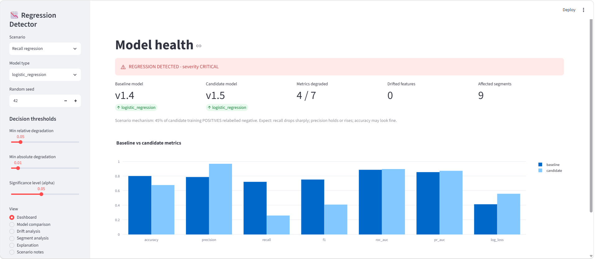
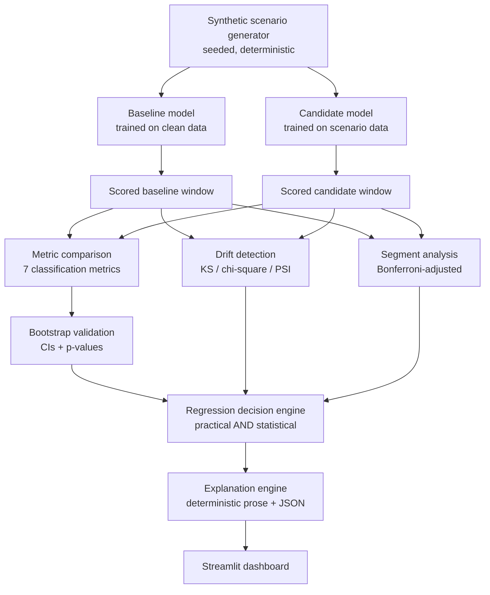

# Model Regression Detection System

**Detect and explain when a new ML model is materially worse than the one it replaces — with statistical evidence, not vibes.**




## The problem

Every retrain-and-redeploy cycle asks the same question: *is the candidate model safe to ship?* Comparing two accuracy numbers answers it badly. Real regressions hide in specific metrics (recall collapses while accuracy holds), in specific segments (one risk band breaks while the aggregate looks fine), and behind statistical noise (a 0.4% dip on 2,000 samples means nothing; the same dip on 200,000 samples is real — and may still not matter). Meanwhile, feature drift gets misread as model failure, and tiny-but-"significant" differences trigger alarms nobody trusts.

This project is a small, self-contained reference implementation of a **model quality gate** that handles those distinctions explicitly.

## What it does

- **Metric comparison with dual significance.** A metric is flagged only when its degradation is *practically* large (configurable absolute + relative thresholds) **and** *statistically* confirmed (two-sample bootstrap, percentile CIs, achieved significance level). Statistically-significant-but-tiny changes are reported as *negligible* — visible, not alarming.
- **Regression vs drift, kept apart.** KS tests + PSI for numeric features, chi-square + PSI for categoricals, KS on prediction scores. Drift is reported as context and never triggers a regression verdict by itself — because features can drift without the model degrading, and models can regress with no visible drift.
- **Segment-level detection.** Per-segment baseline/candidate comparison with Bonferroni-adjusted bootstrap p-values, catching the "overall fine, high-risk segment broken" failure that aggregate metrics hide.
- **Deterministic explanations.** Every verdict comes with prose: what changed, by how much, against what baseline, with what evidence, and what to investigate next. No LLM involved — the explanation engine is pure logic over the evidence, and the same inputs always produce the same text.
- **A scenario lab.** Nine synthetic production scenarios (healthy, accuracy/precision/recall regression, segment regression, feature drift, prediction drift, false alarm, significant-but-negligible), each generated deterministically from a seed, each engineered so the *models genuinely learn* the failure — training labels are corrupted; predictions are never tampered with.

## Quick start

```bash
git clone https://github.com/bdeva1975/model-regression-detector.git
cd model-regression-detector
pip install -r requirements.txt
streamlit run app.py
```

No datasets, no API keys, no services, no network access after install.

## How it works



The detection core (`src/`) has no Streamlit dependency — it is usable as a library:

```python
from src.data.synthetic_generator import GeneratorConfig, Scenario, generate
from src.models.model_factory import train_pair
from src.detection.regression_detector import assess
from src.utils.config import DetectionConfig

bundle = generate(GeneratorConfig(scenario=Scenario.RECALL_REGRESSION))
result = assess(bundle, train_pair(bundle), DetectionConfig())
print(result.to_dict())
```

```json
{
  "regression_detected": true,
  "severity": "CRITICAL",
  "affected_metrics": ["accuracy", "recall", "f1", "log_loss"],
  "largest_degradation": "recall",
  "relative_change_pct": -64.0,
  "statistically_significant": true,
  "practically_significant": true,
  "affected_segments": ["region=East", "..."],
  "drifted_features": [],
  "prediction_drift": false
}
```

## The scenarios

| Scenario | Mechanism | Expected verdict |
|---|---|---|
| Healthy | Candidate trained on clean data | No regression |
| Accuracy regression | Symmetric label noise in candidate training | Broad metric regression |
| Recall regression | Training positives relabelled negative | Recall/F1 collapse; precision rises; AUC holds |
| Precision regression | Training negatives relabelled positive | Precision drops; recall holds |
| Segment regression | Directional noise in one small segment only | Overall near-healthy; `risk_band=high` degrades |
| Feature drift | Non-informative features shifted, labels regenerated | Drift flagged; **no** regression |
| Prediction drift | Most informative feature shifted, labels regenerated | Score distribution moves; **no** regression |
| False alarm | 2% label noise | No material regression |
| Significant-but-small | 4% directional noise, 20k evaluation samples | Statistically significant, practically **negligible**, no alarm |

Every scenario is reproducible: same configuration + seed → identical data, models, and verdict.

## Decision logic

A metric is **REGRESSED** only if all three hold (in its own orientation — log loss degrades upward):

1. absolute degradation ≥ `min_absolute_degradation` (default 0.01)
2. relative degradation ≥ `min_relative_degradation` (default 5%)
3. bootstrap p-value < `significance_level` (default 0.05)

Other statuses: **improved**, **ok**, **negligible** (statistically significant, practically small), **inconclusive** (practically large, statistically unconfirmed). Severity (MODERATE / HIGH / CRITICAL) grades on the worst relative degradation. All thresholds are configurable — from code or live from the dashboard sidebar, where you can watch a verdict flip as you move them.

## Project structure

```text
model-regression-detector/
├── app.py                          # Streamlit dashboard (UI only)
├── src/
│   ├── data/synthetic_generator.py # 9 deterministic scenarios
│   ├── models/model_factory.py     # sklearn pipelines, scoring
│   ├── evaluation/metrics.py       # 7 classification metrics
│   ├── detection/
│   │   ├── statistical_tests.py    # two-sample bootstrap
│   │   ├── drift_detector.py       # KS, chi-square, PSI
│   │   └── regression_detector.py  # the decision engine
│   ├── analysis/
│   │   ├── segment_analysis.py     # per-segment + Bonferroni
│   │   └── explanation.py          # deterministic prose
│   └── utils/config.py             # all thresholds, validated
├── tests/                          # 30 behavioural tests
└── .github/workflows/ci.yml        # lint + tests, py3.12/3.13
```

## Honest limitations

- **Synthetic data only (v0.1).** The generator produces realistic *shapes* of failure, not real-world messiness. The core API is data-agnostic by design; real scored-prediction support is the roadmap's next major item.
- **Independent-windows assumption.** The two-sample bootstrap assumes i.i.d. observations within each window; production windows with temporal correlation violate this and widen true intervals.
- **Percentile bootstrap CIs** can be slightly off for skewed statistics at small n; a minimum sample size is enforced, not a cure.
- **Bonferroni is conservative.** Segment testing controls false alarms at the cost of power on many small segments.
- **Binary classification first.** Regression-task metrics (MAE/RMSE/R²) are architecturally planned but not yet implemented.
- This is a reference implementation for learning and evaluation gates — not a replacement for a production ML observability platform.

## Roadmap

| Version | Scope |
|---|---|
| v0.1 | Synthetic scenarios, detection core, dashboard, tests, CI *(this release)* |
| v0.2 | Regression-task models and metrics; richer statistical tests |
| v0.3 | Bring-your-own scored predictions (CSV/parquet ingestion) |
| v0.4 | CLI + CI/CD quality-gate mode (exit codes for pipelines) |
| v0.5 | Optional LLM-written explanations (user-supplied API key, opt-in) |
| v0.6 | Model registry / MLflow integration |

## Development

```bash
pip install -r requirements.txt
pip install pytest ruff
python -m pytest tests -v        # 30 tests, ~30s
ruff check src tests app.py
```

Contributions welcome — open an issue first for anything non-trivial.

## License

MIT — see [LICENSE](LICENSE).